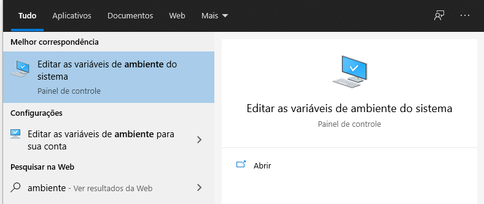

## Introdução

Abordaremos aqui como realizar a análise de código Sonar Qube para projetos baseados em Javascript.

Consideraremos aqui que você já possui conhecimento básico sobre os fundamentos do Sonar Qube.

Caso deseje rever o conteúdo detalhado sobre os fundamentos e conceitos básicos do Sonar Qube consulte este [link](https://github.com/GladsonBruno/SonarQube).

## Pré requisitos

Possuir o Sonar Qube instalado e em execução.

Possuir o [NodeJS](https://nodejs.org/en/) instalado.

Possuir o código fonte de uma aplicação baseada em Javascript.

## Criação do projeto e configuração local

Para analisar código fonte baseado em **Javascript** é necessário realizar o download de um pacote do Sonar Qube e configurá-lo no **path** da máquina.

Veremos como fazer isso neste tópico, mas antes disso precisaremos criar um novo projeto no Sonar Qube.

Para isso vá até o canto superior direito e clique no botão **+** conforme o exemplo abaixo

Em seguida clique em **Create new project** conforme o exemplo abaixo:

Em seguida você será redirecionado para este tela:

Em **Project Key** defina uma chave para o projeto.

Exemplo: **app-exemplo**

Em **Display Name** digite o nome que será exibido para o projeto no Sonar Qube.

Exemplo: **APP Exemplo**

Após preencher os 2 campos clique no botão **Set Up** e você será direcionado para esta tela:

Observe que o Sonar Qube pede para que você gere um novo token ou utilize um existente:

Neste exemplo iremos gerar um novo token com base em um texto.

Utilizarei nesse exemplo o texto **APP Exemplo**

Após definir o texto para o token clique em **Generate** e você verá algo semelhante a isso:

Clique em **Continue** para seguir para o próximo passo.

O segundo passo irá pedir que você informa linguagem a ser analisada, escolha a terceira opção (**Other(JS, TS, GO, Python, PHP, ...)**)

Em seguida selecione o sistema operacional de sua máquina.

Você verá uma tela semelhante a esta dizendo que você deve realizar o download do **Sonar Scanner**, extrair o zip do mesmo em algum diretório e mapear a pasta **bin** do mesmo na variável de ambiente **PATH**.

Observe também que o logo abaixo do botão **Download** o Sonar Qube gera um script para executarmos posteriormente.

Clique em **Download**, em seguida você será direcionado para esta página:

Em seguida clique na versão que mais se adequa ao seu sistema Operacional, como por exemplo **Windows-64-bit**.

Ao fazer isso o download do Sonar Scanner será iniciado.

O próximo passo é extrair o conteúdo do arquivo .zip para algum diretório de sua máquina.

Você verá uma estrutura de diretórios semelhante a esta:

Acesse a pasta bin e copie o **path** dessa pasta.

Exemplo: **C:\Users\Gladson\Documents\sonar-scanner-4.6.0.2311-windows\bin**

O próximo passo e adicionar este path na variável de ambiente **PATH** de sua máquina.

Neste material daremos um exemplo de como realizar isso utilizando windows, caso esteja fazer isso no linux utilize este [artigo](https://linuxize.com/post/how-to-add-directory-to-path-in-linux/) como referência.

Aperte o botão do windows e pesquise por **ambiente**, você verá algo semelhante a isso:

Clique em **Editar as variáveis de ambiente do sistema**

Em seguida clique em **Variáveis de Ambiente**

Localize a variável **Path** e clique em **editar**

Em seguida clique em novo e cole o **path** que copiamos da pasta **bin**.

Após isso clique em **ok** até fechar todas as abas abertas referentes a variáveis de ambiente.

Com isso feito abra um novo terminal e acesse a pasta raiz do projeto **Javascript**.

Acesse novamente a página do Sonar Qube onde estávamos configurando o novo projeto e copie o script indicado pelo Sonar Qube conforme o exemplo abaixo:

O comando gerado pelo Sonar Qube basicamente irá utilizar o Scanner que configuramos nos passos anteriores com alguns parâmetros.

Explicaremos brevemente o funcionamento de cada um dos parâmetros do comando gerado abaixo:

* **-D"sonar.projectKey=chave-projeto"**: Este parâmetro informa ao Sonar a chave de um novo projeto, em nosso caso a chave que criamos foi a chave **app-exemplo**
* **-D"sonar.sources=." **: Este parâmetro indica para o Sonar que o diretório atual contém o código a ser analisado pelo Sonar Qube.
* **-D"sonar.host.url=http://localhost:9000"**: Indica a url de acesso ao Sonar Qube para o endereço **http://localhost:9000**
* **-D"sonar.login=token"**: Este parâmetro contém o token de acesso ao projeto que foi gerado em etapas anteriores.

Guarde o comando gerado pelo Sonar para usos posteriores.

Com o comando copiado volte para o terminal que foi aberto na pasta do projeto a ser analisado, cole o comando no terminal e o execute.

Você verá algo semelhante a isso:

Agora aguarde a execução do comando ser finalizada.

Quando a execução do comando for finalizada volte a página onde estávamos configurando o novo projeto do Sonar Qube.

Note que agora o nosso projeto já está corretamente configurado.

Para realizar uma nova análise de código no mesmo projeto basta executar o comando gerado pelo Sonar Qube novamente na pasta raiz do projeto.